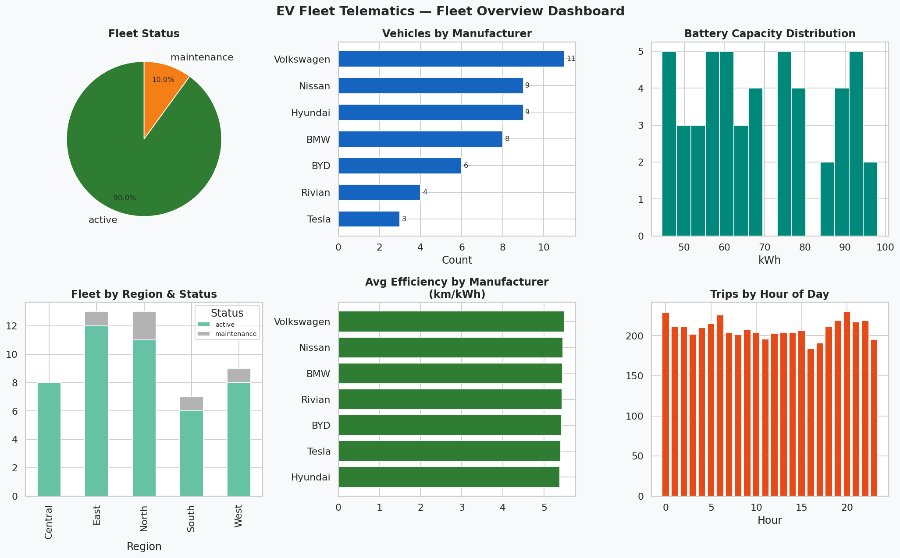
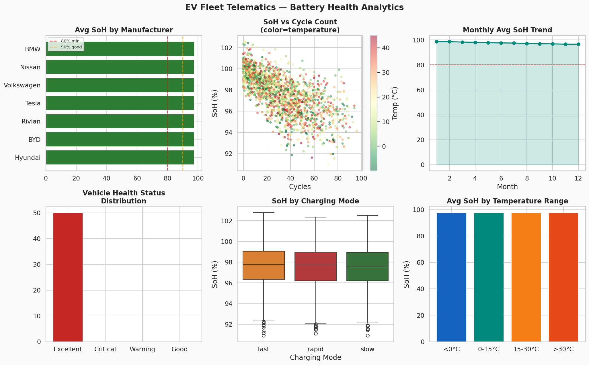
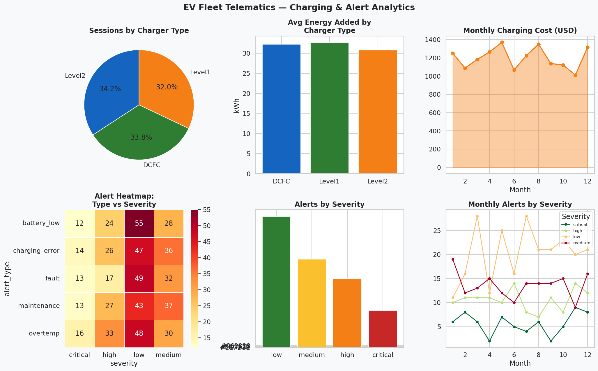

# ⚡ EV Fleet Telematics & Battery Analytics


A full-stack data analytics project simulating real-world EV fleet operations. Covers data engineering, exploratory data analysis, and interactive Power BI dashboards for fleet managers to monitor battery health, trip efficiency, charging behavior, and maintenance alerts.

---

## 📊 Dashboard Previews

### Fleet Overview


### Battery Health Analytics


### Charging & Alert Analytics


---

## 🗂️ Project Structure

```
ev-fleet-telematics/
├── data/
│   ├── generate_data.py        # Synthetic data generator (Faker)
│   ├── load_to_postgres.py     # CSV → PostgreSQL loader
│   ├── vehicles.csv
│   ├── drivers.csv
│   ├── trips.csv               # 5,000 trip records
│   ├── battery_health.csv      # 8,000 battery readings
│   ├── charging_sessions.csv   # 2,000 charging events
│   └── alerts.csv              # 600 fleet alerts
├── sql/
│   ├── schema.sql              # PostgreSQL table definitions
│   └── queries.sql             # Analytical queries for Power BI
├── notebooks/
│   └── ev_fleet_eda.ipynb      # Full EDA Jupyter notebook
├── docs/
│   └── powerbi_dax_guide.md   # DAX measures & Power BI setup guide
├── assets/
│   ├── dashboard_fleet_overview.png
│   ├── dashboard_battery_health.png
│   └── dashboard_charging_alerts.png
├── requirements.txt
└── README.md
```

---

## 🛠️ Tech Stack

| Tool | Purpose |
|------|---------|
| **Python 3.11** | Data generation, EDA, visualization |
| **pandas / numpy** | Data manipulation & analysis |
| **matplotlib / seaborn** | Charts and exploratory plots |
| **PostgreSQL 16** | Relational database backend |
| **SQLAlchemy / psycopg2** | Python ↔ PostgreSQL connection |
| **Faker** | Synthetic data generation |
| **Power BI Desktop** | Interactive dashboard |
| **DAX** | Calculated measures in Power BI |

---

## 🚀 Setup & Run

### 1. Clone the repo
```bash
git clone https://github.com/YOUR_USERNAME/ev-fleet-telematics.git
cd ev-fleet-telematics
```

### 2. Install Python dependencies
```bash
python -m venv venv
source venv/bin/activate        # Windows: venv\Scripts\activate
pip install -r requirements.txt
```

### 3. Set up PostgreSQL
```sql
-- In psql or pgAdmin:
CREATE DATABASE ev_fleet_db;
```

### 4. Create schema
```bash
psql -U postgres -d ev_fleet_db -f sql/schema.sql
```

### 5. Generate & load data
```bash
python data/generate_data.py       # Creates CSV files in data/
# Edit DB password in load_to_postgres.py, then:
python data/load_to_postgres.py    # Loads CSV → PostgreSQL
```

### 6. Run the EDA notebook
```bash
jupyter notebook notebooks/ev_fleet_eda.ipynb
```

### 7. Open Power BI
- Open Power BI Desktop
- Get Data → PostgreSQL → `localhost` / `ev_fleet_db`
- Import all tables and follow `docs/powerbi_dax_guide.md`

---

## 📈 Key Metrics & Insights

- **50 vehicles** across 5 regions from 7 EV manufacturers
- **5,000 trips** with distance, speed, energy usage and SoC tracking
- **Battery SoH** monitored over 8,000 readings with degradation curves
- **Charging cost analysis** across Level 1 / Level 2 / DCFC chargers
- **Alert resolution tracking** with severity classification (critical → low)
- **Driver efficiency leaderboard** by km/kWh

---

## 📌 Power BI Dashboard Pages

| Page | KPIs & Visuals |
|------|---------------|
| Fleet Overview | Active vehicles, Total trips, Efficiency by region |
| Battery Health | SoH trend, Degradation scatter, Critical vehicles |
| Trip Analytics | Distance distribution, Hourly heatmap, Speed vs efficiency |
| Charging | Cost trend, Charger type breakdown, Energy added |
| Alerts | Severity heatmap, Resolution rate, Monthly trend |

---

## 👤 Author

**[Your Name]**  
Data Analyst | Python · SQL · Power BI  
[LinkedIn](https://linkedin.com/in/yourprofile) · [GitHub](https://github.com/YOUR_USERNAME)
